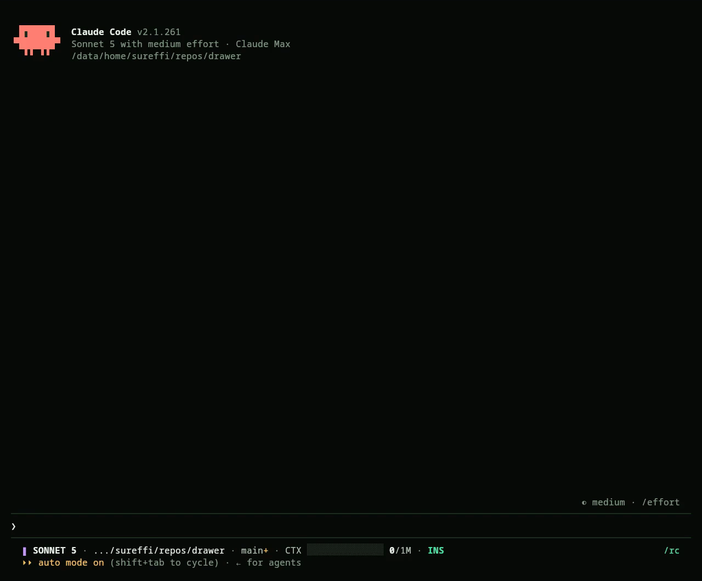
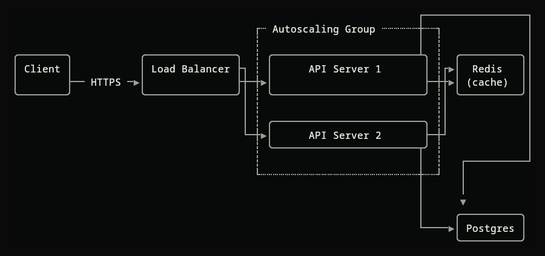

# drawer

[](https://github.com/sureffi/drawer/actions/workflows/check.yml)

A ```dot fence in Claude Code becomes a drawing, in place, as the reply
streams.



## install

    /plugin marketplace add sureffi/drawer
    /plugin install drawer@drawer

Then ask for a graph. The model writes DOT; you see the picture.

Linux and macOS. Nothing else to install: graphviz, the type and the
painting are all in the binary.

The pictures need kitty or ghostty, the terminals that draw the placeholder
cells a picture lives in — through tmux too. Anywhere else the graph is
drawn in box drawing, which every terminal draws with its own hand.



## settings

Three environment variables, set for `claude` in `settings.json` or the shell:

    { "env": { "DRAWER_RENDER": "cells",
               "DRAWER_THEME":  "/home/me/.config/drawer/theme.dot",
               "DRAWER_TEE":    "/home/me/drawer-deltas.jsonl" } }

- `DRAWER_RENDER` forces a drawing: `auto`, `pixels` or `cells`.
- `DRAWER_THEME` names a theme file.
- `DRAWER_TEE` records every payload the hook receives, for `drawer -deltas` to replay.

`drawer -doctor` prints what this terminal gets and why. The binary is at
`~/.claude/plugins/data/drawer-drawer/drawer`.

## theme

Pictures use Claude Code's own theme: `theme` in `~/.claude/settings.json`,
custom themes included. Nodes take `userMessageBackground` and `text`,
strokes `claude`, edge labels `success`, clusters `inactive` and `subtle`.
What the model coloured itself stays as written. Switching theme repaints
the pictures already drawn, at the next reply.

A theme file is DOT defaults, applied to every graph:

    drawer -show-theme                            # the current theme as DOT; start a file from it
    drawer -theme t.dot -dot g.dot -png out.png   # render a graph with it, no session needed

`themes/tokyonight.dot` and `themes/tokyonight-day.dot` are examples. A file
replaces the theme; anything it leaves out is graphviz's default. `fontname`
may point at a font file (`.ttf`, `.otf`, `.ttc`); otherwise text is set in
the bundled Go Mono. Layout is measured in Courier, so use a monospace face.

## how it works

Claude Code's `MessageDisplay` hook hands a command each piece of an
assistant message before it is displayed and takes back replacement text.
drawer replaces a ```dot fence with the drawing. The transcript keeps the
fence; only the display changes. Pieces arrive split wherever Claude Code
splits them, one process each, so the fence is reassembled through a state
file keyed by message id.

`SessionStart` puts the binary in place and hands the model one line: a
```dot fence draws in place. Without the line the model writes mermaid.

Layout is graphviz, compiled to WebAssembly and embedded
(`goccy/go-graphviz`). A layout takes about a millisecond.

Pictures are painted in the binary from graphviz's own drawing operations,
with the bundled Go Mono at the size that puts one glyph in one cell. The
PNG goes to a temp file and one short kitty graphics escape names it, down
the parent's tty, because Claude Code strips graphics escapes out of hook
output. The terminal shows the image in Unicode placeholder cells, which
ride through Claude Code as ordinary text. Under tmux the escape is wrapped
in tmux's passthrough and `allow-passthrough` is turned on for the pane
claude is in.

A graph wider than the window is laid out top-down instead. One taller than
120 rows is not drawn; the source shows under a notice saying why. A fence
labelled `dot` or `graphviz` is drawn, and so is an unlabelled fence that
opens with `digraph {` or `graph {`. Other fences pass through untouched.

Where the terminal cannot show pictures the same graph is drawn in box drawing.

## known wrong

- A drawing is correct at the width it was drawn for. Claude Code re-wraps
  hook output on resize without asking again, so it shreds narrower and
  comes back when the window does.
- `--resume` shows every fence as source. The hook does not fire for a
  replayed transcript.
- macOS runs the whole test suite in CI, but a runner has no terminal, so
  the terminal path on a Mac is unverified. If it is wrong, drawings fall
  back to box drawing at 100 columns.
- Installed mid-session and reloaded with `/reload-plugins`, `SessionStart`
  does not fire, so the model is not told about the hook until a new session.
  A ```dot fence it writes anyway is drawn.
- Text is Go Mono. Characters it lacks, CJK and emoji among them, draw as
  the replacement character. Glyph drawings still show them.
- A theme switch repaints at the next reply, not at the switch. A theme that
  changes the type changes the layout, and a picture that no longer fits its
  old cut is left as it was.
- Claude Code's `auto` theme draws dark. The hook cannot ask the terminal.
- The stock palettes are copied from Claude Code 2.1.257 and drift when
  Claude Code changes them.
- A fence under a list item is drawn at the window's width less its indent.
  What Claude Code actually gives it is unmeasured.

## developing

    git clone https://github.com/sureffi/drawer && cd drawer
    scripts/check.sh
    /plugin marketplace add /path/to/drawer     # in claude
    /plugin install drawer@drawer

Claude Code copies the tree into its cache but runs the hooks with the
checkout as plugin root, so the checkout's `bin/drawer` is what the next
reply runs and `scripts/check.sh` rebuilds it. A change to the wrapper or
the manifests needs a reinstall.

`scripts/check.sh` is every check in one command: build, vet, a vet
cross-compiled for macOS, the import graph held to a table, the tests under
`-race`, both rungs on a fixture, the theme files, the plugin manifests and
wrapper, the pixels rung to a PNG, and recorded hook streams replayed. CI
runs it on Linux and macOS on every push.

Offline, without a session:

    ./bin/drawer -dot FILE -size WxH -render cells     # draw a file
    ./bin/drawer -dot FILE -png OUT [-cell 10x24]      # the picture, to a file
    ./bin/drawer -deltas FILE -render cells            # replay a recorded turn; nonzero if damaged
    ./bin/drawer -context                              # the line the model is handed
    ./bin/drawer -doctor                               # what this terminal gets and why

`DRAWER_TEE` records a live session as a `-deltas` fixture. A replay checks
that prose outside a fence comes back byte for byte and every fence comes
back untouched or as one drawn block that fits its width.

`scripts/drawer` is the plugin's two hooks. It puts the binary in place by
the first way that works: a checkout's `bin/drawer`, linked; the binaries
shipped in the release zip; a download of the release binary for the
platform, checked against the sha256 pinned in the script; or `go build`.
An organisation that can only point a marketplace at git gets the download.

`scripts/release.sh VERSION` builds the four binaries, pins their sums into
the wrapper, zips the plugin, points the marketplace at the zip, commits,
tags, pushes and creates the GitHub release.

The tree, one binary and nine packages, every import pointing down:

    cmd/drawer/          the binary
    internal/drawer      the flags, the hook wire, the ladder of rungs, the ledger
    internal/pixel       the pixels rung: the themed drawing, the painter, the cut, the placeholders
    internal/theme       Claude Code's theme, and a theme file
    internal/cells       the cells rung: box drawing, edges routed on the grid, clusters framed
    internal/notice      why there is no drawing, drawn
    internal/fence       a fence in, a drawing or the same bytes out
    internal/layout      graphviz: the one door, its drawing as data, the scale to cells
    internal/grid        a row of terminal cells, and what text costs in one
    internal/term        the parent's terminal: how big it is, where its output goes
    scripts/             the hooks, the checks, the release
    themes/              two theme files to start from
    demo/                the session the README shows, and how it was made
    testdata/            a graph, and the recorded hook streams

Windows does not build; the hook wire is Unix.

## license

MIT. The embedded graphviz is under the Eclipse Public License 1.0 and the
embedded Go Mono under the Go project's licence; a built binary
redistributes both. NOTICE has the details.
